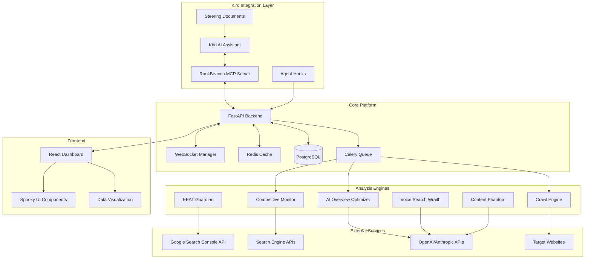
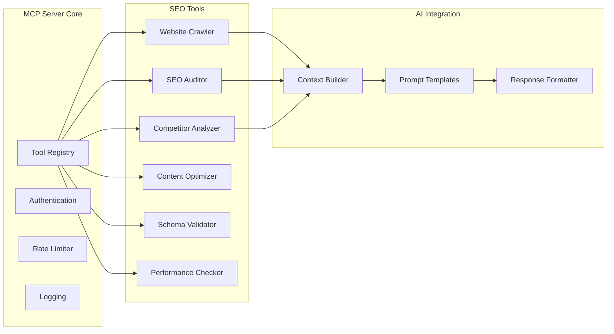

# RankBeacon SEO Exorcist - Design Document

## Overview

RankBeacon is a sophisticated SEO monitoring platform that leverages multiple Kiro capabilities to create an immersive, AI-powered experience. The system combines a custom MCP server, agent hooks, steering documents, and spec-driven development to deliver conversational SEO auditing with a supernatural twist. The architecture supports real-time crawling, competitive intelligence, AI-powered content optimization, and predictive analytics through a themed interface that gamifies SEO health monitoring.

## Architecture

### High-Level System Architecture



### MCP Server Architecture

The RankBeacon MCP Server extends Kiro's capabilities with specialized SEO tools:



## Components and Interfaces

### 1. MCP Server Tools

#### Core SEO Tools
```typescript
interface SEOTools {
  // Website Analysis
  crawlWebsite(domain: string, options: CrawlOptions): Promise<CrawlResult>
  auditSEO(url: string): Promise<SEOAudit>
  checkPageSpeed(url: string): Promise<PerformanceMetrics>
  validateSchema(url: string): Promise<SchemaValidation>
  
  // Competitive Analysis
  analyzeCompetitors(domain: string, competitors: string[]): Promise<CompetitiveAnalysis>
  trackRankings(keywords: string[], domain: string): Promise<RankingData>
  
  // AI-Powered Optimization
  optimizeForAIOverview(content: string, topic: string): Promise<OptimizationSuggestions>
  analyzeContentGaps(domain: string, niche: string): Promise<ContentGaps>
  optimizeForVoiceSearch(content: string): Promise<VoiceOptimization>
  assessEEAT(url: string): Promise<EEATScore>
}
```

#### Advanced Analysis Tools
```typescript
interface AdvancedTools {
  // Predictive Analytics
  predictRankingChanges(domain: string, timeframe: number): Promise<RankingPrediction>
  detectAlgorithmImpact(domain: string, dateRange: DateRange): Promise<AlgorithmImpact>
  
  // Content Intelligence
  generateContentBrief(topic: string, competitors: string[]): Promise<ContentBrief>
  identifyFeaturedSnippetOpportunities(domain: string): Promise<SnippetOpportunities>
  
  // Technical SEO
  auditCoreWebVitals(domain: string): Promise<WebVitalsReport>
  analyzeCrawlability(domain: string): Promise<CrawlabilityReport>
}
```

### 2. Agent Hooks Integration

#### Automated Monitoring Hooks
```typescript
interface AutomationHooks {
  // Scheduled Monitoring
  dailySEOHealthCheck: Hook<{domain: string}, SEOHealthReport>
  weeklyCompetitorAnalysis: Hook<{competitors: string[]}, CompetitiveReport>
  monthlyContentGapAnalysis: Hook<{domain: string}, ContentStrategy>
  
  // Event-Driven Hooks
  onRankingDrop: Hook<{threshold: number}, AlertResponse>
  onAlgorithmUpdate: Hook<{updateType: string}, ImpactAnalysis>
  onNewCompetitorContent: Hook<{competitor: string}, OpportunityAlert>
  
  // Development Integration
  onDeployment: Hook<{url: string}, SEORegressionCheck>
  onContentPublish: Hook<{url: string}, SEOOptimizationCheck>
}
```

### 3. Steering Documents

#### SEO Best Practices Steering
- **seo-technical-guidelines.md**: Technical SEO standards and validation rules
- **content-optimization-strategies.md**: AI-powered content optimization approaches
- **competitive-analysis-methods.md**: Competitor monitoring and analysis techniques
- **algorithm-update-responses.md**: Strategies for handling search engine algorithm changes

### 4. Spooky UI Components

#### Theme System
```typescript
interface SpookyTheme {
  entities: {
    ghosts: Ghost404Component[]      // 404 errors
    zombies: ZombiePageComponent[]   // Orphaned pages
    monsters: CompetitorComponent[]  // Competitor threats
    specters: SchemaComponent[]      // Schema issues
    phantoms: ContentGapComponent[]  // Content opportunities
    wraiths: VoiceSearchComponent[]  // Voice search issues
    guardians: EEATComponent[]       // Trust signals
  }
  
  animations: {
    floating: CSSAnimation
    shambling: CSSAnimation
    lurking: CSSAnimation
    materializing: CSSAnimation
    vanishing: CSSAnimation
  }
  
  soundEffects: {
    ghostlyWhisper: AudioClip
    zombieGroan: AudioClip
    monsterRoar: AudioClip
    spellCasting: AudioClip
    victoryCelebration: AudioClip
  }
}
```

#### Interactive Graveyard Dashboard
```typescript
interface GraveyardDashboard {
  layout: {
    tombstones: SEOMetricTombstone[]  // Key metrics as tombstones
    hauntedTree: SiteStructureTree    // Site structure as spooky tree
    fogOfWar: CompetitorOverlay       // Competitor analysis overlay
    moonPhases: AlgorithmTimeline     // Algorithm updates as moon phases
  }
  
  interactions: {
    exorciseIssue: (issue: SEOIssue) => ExorcismAction
    summonReport: (type: ReportType) => ObituaryReport
    castProtection: (domain: string) => MonitoringSpell
    banishCompetitor: (competitor: string) => CompetitiveAction
  }
}
```

## Data Models

### Core SEO Data Models

```typescript
interface SEOAudit {
  id: string
  domain: string
  timestamp: Date
  hauntingScore: number  // 0-100, lower is more haunted
  
  technicalIssues: {
    ghosts: Ghost404[]           // 404 errors
    zombies: OrphanedPage[]      // Pages with no internal links
    specters: SchemaIssue[]      // Structured data problems
  }
  
  contentIssues: {
    phantoms: ContentGap[]       // Missing content opportunities
    wraiths: VoiceSearchGap[]    // Voice search optimization gaps
  }
  
  competitiveThreats: {
    monsters: CompetitorThreat[] // Competitor advantages
  }
  
  trustSignals: {
    guardians: EEATSignal[]      // E-E-A-T indicators
  }
}

interface CrawlResult {
  pages: PageAnalysis[]
  siteStructure: SiteMap
  technicalMetrics: TechnicalMetrics
  contentAnalysis: ContentAnalysis
  performanceMetrics: PerformanceMetrics
}

interface CompetitiveAnalysis {
  competitors: CompetitorProfile[]
  marketGaps: OpportunityGap[]
  threatLevel: ThreatAssessment
  recommendations: CompetitiveStrategy[]
}
```

### AI-Powered Analysis Models

```typescript
interface AIOptimizationResult {
  aiOverviewOptimization: {
    currentScore: number
    recommendations: OptimizationTip[]
    contentStructure: StructureAdvice[]
    factualAccuracy: AccuracyCheck[]
  }
  
  featuredSnippetOpportunities: {
    targetQueries: string[]
    contentFormat: SnippetFormat
    optimizationSteps: OptimizationStep[]
    competitorAnalysis: SnippetCompetition[]
  }
  
  voiceSearchOptimization: {
    conversationalQueries: string[]
    contentAdjustments: VoiceOptimization[]
    localSEOFactors: LocalOptimization[]
  }
}

interface ContentGapAnalysis {
  missingTopics: TopicOpportunity[]
  contentFormats: FormatRecommendation[]
  keywordOpportunities: KeywordGap[]
  competitorContent: CompetitorContent[]
  priorityScore: number
}
```

## Error Handling

### Graceful Degradation Strategy

```typescript
interface ErrorHandling {
  crawlFailures: {
    timeout: RetryWithBackoff
    rateLimit: QueueForLater
    serverError: LogAndContinue
    authFailure: NotifyUser
  }
  
  apiFailures: {
    searchConsole: UseCachedData
    competitorAPI: SkipCompetitorAnalysis
    aiService: FallbackToRuleBasedAnalysis
  }
  
  userExperience: {
    partialResults: ShowAvailableData
    serviceDown: ShowMaintenanceMode
    dataCorruption: RestoreFromBackup
  }
}
```

### Spooky Error Messages

```typescript
interface SpookyErrorMessages {
  crawlTimeout: "The spirits are taking longer than usual to explore your domain..."
  rateLimit: "The digital realm is overwhelmed. The ghosts need a moment to rest..."
  serverError: "A dark force is blocking our path. The exorcism will resume shortly..."
  noData: "The graveyard is eerily quiet. No supernatural activity detected..."
}
```

## Testing Strategy

### Comprehensive Testing Approach

#### Unit Testing
- MCP server tool functions
- SEO analysis algorithms
- Spooky UI component rendering
- Data model validation
- Error handling scenarios

#### Integration Testing
- Kiro MCP communication
- Agent hook triggers
- External API integrations
- Database operations
- WebSocket real-time updates

#### End-to-End Testing
- Complete SEO audit workflows
- Competitive analysis pipelines
- AI optimization recommendations
- Spooky theme transformations
- Multi-user concurrent usage

#### Performance Testing
- Large website crawling
- Concurrent user sessions
- Real-time data streaming
- Memory usage optimization
- API response times

### Testing with Spooky Scenarios

```typescript
interface SpookyTestScenarios {
  hauntedWebsite: {
    description: "Website with maximum SEO issues"
    expectedGhosts: 50+     // 404 errors
    expectedZombies: 20+    // Orphaned pages
    expectedSpecters: 15+   // Schema issues
    hauntingScore: 15       // Very haunted
  }
  
  blessedWebsite: {
    description: "Perfect SEO health website"
    expectedIssues: 0
    hauntingScore: 95       // Nearly blessed
    expectedCelebration: true
  }
  
  competitorInvasion: {
    description: "Competitor gaining significant advantage"
    expectedMonsters: 5+    // Major threats
    alertLevel: "CRITICAL"
    exorcismRequired: true
  }
}
```

## Performance Considerations

### Scalability Architecture

- **Horizontal Scaling**: Containerized microservices with Kubernetes orchestration
- **Caching Strategy**: Multi-layer caching with Redis for hot data and CDN for static assets
- **Database Optimization**: Read replicas for analytics, partitioned tables for historical data
- **Queue Management**: Celery with Redis broker for background processing
- **Rate Limiting**: Intelligent rate limiting based on user tier and API quotas

### Real-Time Features

- **WebSocket Connections**: Real-time crawl progress and issue notifications
- **Server-Sent Events**: Live competitive monitoring alerts
- **Progressive Loading**: Incremental data loading for large audits
- **Optimistic Updates**: Immediate UI feedback with background validation

This design creates a sophisticated, multi-faceted platform that showcases advanced Kiro integration while delivering genuine SEO value through an engaging, memorable interface.
